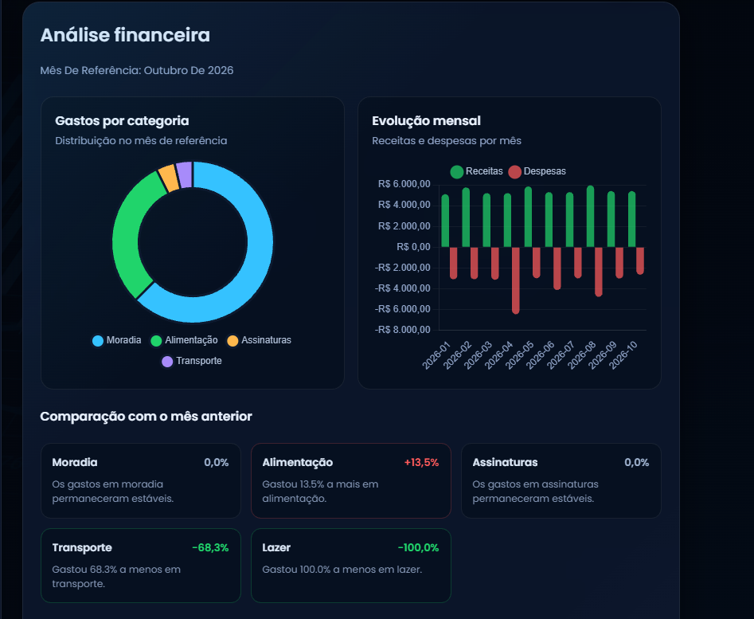

# EZSaldo • Financial management and analytics


[](https://ezsaldo.vercel.app)

**EZSaldo** is a full-stack financial application for tracking income and expenses, monitoring balance changes, and turning transaction history into clear insights.

In addition to traditional financial management, the project includes an independent Python service for statistical calculations, projections, and reports. It demonstrates a realistic, secure architecture designed to evolve.

## The product

- Registration, JWT authentication, and user profiles with avatars.
- Income and expenses organized by category and user.
- History filters by date, type, and amount, plus balance changes by period.
- Spending by category, monthly trends, and previous-month comparisons.
- IQR-based unusual expense detection and moving-average balance estimates.
- Monthly PDF reports, responsive layout, and a read-only demo account.

## Financial analytics



The analytics service is stateless and has no database access. Node authenticates the user, retrieves only their transactions, and sends Python only the fields required for analysis.

```text
Frontend ── JWT ──> Node.js / Express ──> MongoDB
                         │
                         └── internal key ──> FastAPI + pandas
```

The browser never calls FastAPI directly. If the analytics service is unavailable, only this section displays an error; transactions, profile management, and balance tracking remain available.

### Technical decisions

- **Separate Python service:** pandas handles grouping, time series, and statistics without coupling these tasks to the authentication and CRUD backend.
- **IQR for unusual expenses:** it is less sensitive to extreme values than the mean and standard deviation. An expense is flagged above `Q3 + 1.5 × IQR`.
- **Moving average:** it uses the net result of the last 3 complete months. When data is insufficient, the API returns a warning instead of a misleading projection.
- **Security:** JWT protects the public API, an internal key protects Node → Python communication, and every query is scoped to the authenticated user ID.

## Stack

- **Frontend:** HTML5, CSS3, JavaScript, and Chart.js.
- **Backend:** Node.js, Express, Mongoose, JWT, and bcrypt.
- **Analytics:** Python, FastAPI, Pydantic, pandas, and ReportLab.
- **Data and infrastructure:** MongoDB, Docker Compose, and Vercel.

## Running locally

### Recommended: Docker Compose

Requirements: Docker Desktop running with Docker Compose available.

1. Create the environment file:

```powershell
Copy-Item .env.example .env
```

2. In `.env`, set long, different values for `JWT_SECRET` and `ANALYTICS_API_KEY`.

3. Build and start all services:

```powershell
docker compose up --build
```

4. Open:

- Frontend: `http://localhost:8080`
- Backend: `http://localhost:5000`
- FastAPI is available only on the internal Compose network.

To stop the application:

```powershell
docker compose down
```

### Demo account

```text
Email:    demo.ezsaldo@example.test
Password: EZSaldo-Demo-2026
```

This account is read-only. The 70 synthetic transactions are restored to their original state when the backend starts and every 30 minutes while it remains active. Real accounts are never affected.

### Running without Docker

Start MongoDB and configure each service using its `.env.example`. Then run the following commands in separate terminals:

```powershell
# Node backend
cd backend
npm install
npm run dev
```

```powershell
# Python service
cd analytics-service
python -m venv .venv
.\.venv\Scripts\Activate.ps1
pip install -r requirements.txt
uvicorn app.main:app --reload --port 8000
```

Serve the `frontend/` directory on `localhost`. Use the same key for Node's `ANALYTICS_API_KEY` and Python's `INTERNAL_API_KEY`.

## Main configuration

| Variable | Purpose |
|---|---|
| `MONGO_URI` | MongoDB connection string |
| `JWT_SECRET` | JWT signing secret |
| `ANALYTICS_SERVICE_URL` | Internal FastAPI URL |
| `ANALYTICS_API_KEY` | Key shared by Node and Python |
| `ANALYTICS_TIMEOUT_MS` | Analytics timeout; default: 5 seconds |
| `DEMO_ACCOUNT_ENABLED` | Enables the demo account |
| `DEMO_ACCOUNT_RESET_INTERVAL_MINUTES` | Restore interval; default: 30 minutes |

`.env` files are not committed. The repository contains only examples without secrets.

## Screenshots

### Login


### Dashboard


### Profile editing


### Avatar cropping


## Deployment

The frontend is prepared for Vercel, the Node backend for a web service, the database for MongoDB Atlas, and FastAPI for an independent Docker service. In production, keep FastAPI inaccessible to the browser and configure every secret through the hosting provider's environment variables.
